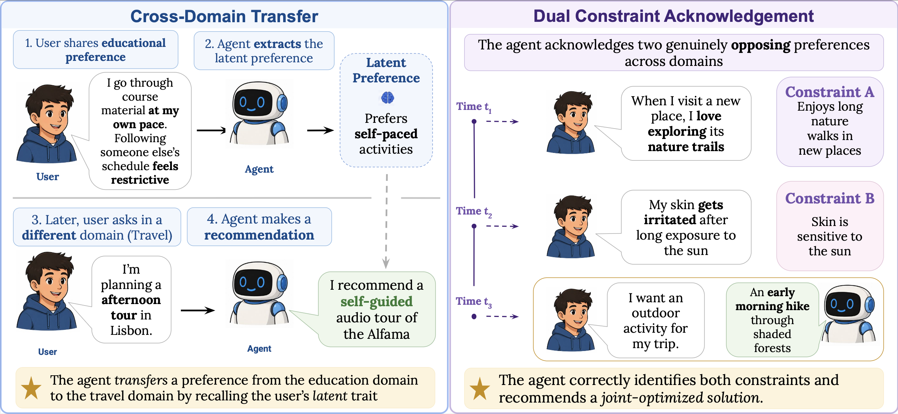

<div align="center">

# CrossMemBench

### A Memory Benchmark for Cross-Domain Preference Transfer and Conflict Preservation

[](https://www.python.org/downloads/)
[](https://huggingface.co/datasets/devesht01/CrossMemBench)
[](https://openreview.net/forum?id=2BbJhtU7wa)


[**Benchmark Overview**](#benchmark-overview) ·
[**Quick Start**](#quick-start) ·
[**Dataset**](#dataset) ·
[**Tasks & Metrics**](#tasks--metrics) ·
[**Citation**](#citation)

</div>

## Benchmark Overview

**What is cross-domain personalization?** Users express preferences in domain-specific contexts, but the underlying preference may remain relevant to decisions in other areas of their lives, while preferences from different domains may also impose competing constraints on the same decision.

### Key Points

* **Two complementary evaluation settings:** **CMRT** evaluates whether agents can transfer latent user preferences across domains, while **DCA** evaluates whether they can jointly preserve conflicting preferences expressed in different domains.
* **Five functionally distinct life domains:** education, travel, health, finance, and food/dining.
* **40 coherent user profiles and 560 benchmark items:** including **200 CMRT** and **360 DCA** questions with controlled ground-truth memories.
* **Evaluation under memory interference:** systems are tested with **0, 100, 500, and 1,000 distractor memories** to measure retrieval robustness as memory stores grow.
* **Memory-grounded scoring:** evaluation requires both a correct decision and a justification grounded in the relevant memories, while retrieval is tracked separately from downstream task accuracy.

<p align="center">
  
</p>

Overview of CrossMemBench. Left: CMRT tests whether an agent can abstract a preference from one life domain and apply it in another. Right: DCA tests whether an agent can retrieve opposing cross-domain preferences and recommend a response that preserves both constraints.

## Quick Start

### Installation

```bash
git clone https://github.com/devesht01/CrossMemBench.git
cd CrossMemBench

conda create -n crossmembench python=3.13
conda activate crossmembench

pip install -r requirements.txt
```


### Install Dataset

```bash
hf download devesht01/CrossMemBench \
  --repo-type dataset \
  --include "data/**" \
  --local-dir .
```

### API Keys (needed)

```bash
export OPENAI_API_KEY="YOUR_API_KEY"
export GOOGLE_API_KEY="YOUR_API_KEY"
```

### Run Evaluation

The default evaluation runs the **Dense Retrieval results from the paper using the weak backbone**:

```bash
./run.sh --provider gemini --model gemini-3.1-flash-lite --noise-levels 0,100,500,1000 --memory-provider dense_retrieval
```

The main flags are:

* `--provider`: LLM provider used for the agent.
* `--model`: model used as the agent backbone.
* `--noise-levels`: comma-separated distractor memory pool sizes to evaluate.
* `--memory-provider`: memory system used during evaluation.

This repository ships with the following memory providers:

* `full_dump` (injects the entire memory store into the model context, bypassing any retrieval mechanism)
* `dense_retrieval`
* `no_mem`

The script will:

* Run the CrossMemBench evaluation on all questions.
* Evaluate each specified noise level.
* Print the final metrics / analysis to the terminal.
* Save all outputs under `results/` in a run directory named `<memory_provider>_<timestamp>/`.
* Save the final analysis as `analysis.json` inside the run directory.

### Adding a Memory System

CrossMemBench is designed to make it straightforward to evaluate additional memory systems.

To add a new memory provider:

1. Implement the interface defined in [`providers/base.py`](providers/base.py). `retrieve_memories` returns two strings: the context shown to the agent, and a raw dump that must include the retrieved `memory_id` values so CrossMemBench can score retrieval separately from task accuracy.
2. Register the provider in [`providers/__init__.py`](providers/__init__.py) by adding its factory function and including it in `MEMORY_PROVIDERS`.
3. Add a required provider-specific configuration file at `configs/<memory_provider>.yaml`. This configuration is automatically overlaid on top of `configs/config.yaml`, and provider-specific settings should be defined there.
4. Select the provider with `./run.sh --memory-provider <name>`.

After these changes, the new memory system can be evaluated using the same CrossMemBench pipeline and metrics as the built-in providers.


## Dataset

The CrossMemBench dataset is available on Hugging Face:

[](https://huggingface.co/datasets/devesht01/CrossMemBench)

The dataset is organized as follows:

```text
data/
├── profiles.json
├── noise.json
├── u001/
│   └── u001.json
├── u002/
│   └── u002.json
└── ...
```

* **`profiles.json`** contains the descriptions for all 40 user profiles.
* **`noise.json`** contains approximately 2,200 distractor memories used to evaluate retrieval robustness under increasing memory interference.
* **`uXXX/uXXX.json`** contains the benchmark data associated with each individual user profile.

We release the prompts used during dataset construction in [`data_generation_prompts/`](data_generation_prompts/). The full dataset-generation scripts are not included, as dataset generation is outside the scope of this repository. The dataset generation and human validation procedures, along with associated design choices, are described in detail in the [paper](https://openreview.net/forum?id=2BbJhtU7wa).

## Tasks & Metrics

CrossMemBench evaluates whether memory-augmented LLM agents can transfer latent user preferences across domains and preserve conflicting cross-domain constraints in personalized decision-making.

- **CMRT:** Measures whether a memory expressed in one domain can be surfaced and correctly applied to a query in another domain.
  - Example: a preference for self-paced learning in **education** should transfer to recommending a **self-guided tour** in **travel**.
  - Score: fraction of CMRT items answered correctly.

- **DCA:** Measures whether a system can surface two simultaneously valid but conflicting preferences from different domains and produce a jointly optimizing response.
  - Example: a preference for **nature trails** and a **sensitivity to prolonged sun exposure** should lead to a recommendation such as an **early-morning hike through shaded forests**.
  - Score: fraction of DCA items answered correctly with both constraints preserved.


### Retrieval Scoring

CrossMemBench evaluates retrieval separately from downstream task accuracy. Each memory provider returns both the context shown to the agent and a raw retrieval dump containing the retrieved `memory_id` values. CrossMemBench uses these IDs to determine whether the gold memories required for each item were retrieved.

- **CMRT retrieval:** counted as successful when the item's single gold memory is present in the retrieved memories.
- **DCA retrieval:** counted as successful only when both gold memories are present. Retrieving only one gold memory is treated as partial retrieval, while retrieving neither is treated as no retrieval.

This separation allows CrossMemBench to distinguish retrieval failures from cases where the required memories were available to the agent but were not used correctly.


For complete definitions and evaluation methodology, see our [paper](https://openreview.net/forum?id=2BbJhtU7wa).


## Reproducibility

CrossMemBench evaluations use LLM-based agents and an LLM judge, so exact numerical reproduction across independent runs is not guaranteed, even at temperature zero. Run-to-run differences may occur due to model nondeterminism, but do not affect the paper’s overall findings.


## License
The code is released under the MIT License (see [LICENSE](LICENSE)), while the CrossMemBench dataset is released under the CC BY 4.0 License.

## Citation

If you use CrossMemBench in your research, please cite:

```bibtex
@inproceedings{
  tiwari2026crossmembench,
  title={CrossMemBench: A Memory Benchmark for Cross-Domain Preference Transfer and Conflict Preservation},
  author={Devesh Tiwari},
  booktitle={COLM 2026 The 2nd Workshop on Lifelong Agents: Learning, Aligning, and Evolving},
  year={2026},
  url={https://openreview.net/forum?id=2BbJhtU7wa}
}
```